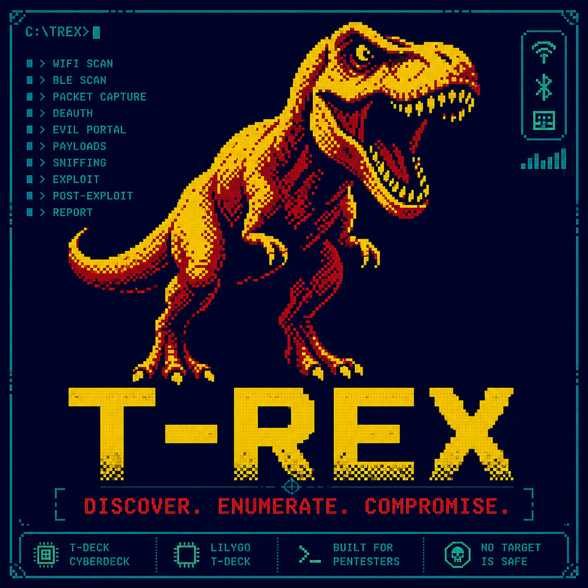

<p align="center">
  
</p>

# T-Rex

**Offensive security firmware for the LilyGo T-Deck — hacker CLI in your pocket.**

T-Rex turns the LilyGo T-Deck into a pocket pentesting terminal. No menus, no GUI — just a blinking cursor, a physical keyboard, and a full suite of offensive security tools running on an ESP32-S3.

---

> ⚠️ **Legal Disclaimer** — For authorized security testing, CTF competitions, and educational use only. Always get written permission before testing.

---

## Documentation

| Guide | What's covered |
|-------|---------------|
| [WiFi Attacks](wifi-attacks) | scanwifi, connectwifi, wifimon, deauth, eviltwin, hiddenssid, wpasniff, macchanger, **wguard** (WiFi IDS) |
| [WiFi Credentials](wifi-credentials) | wifipass, saved passwords, Linux wpa_supplicant.conf sync, desktop migration |
| [Network Recon](network) | netdiscover, portscan, topscan, ping, banner grabber, OS fingerprinting |
| [Bluetooth](bluetooth) | scanblue, trackme, fastpair, blespam |
| [Claude Desktop Buddy](buddy) | bd — BLE remote, permission approval, ASCII pet, stats |
| [Anti-Tracking](trackme) | Full trackme algorithm guide — baseline, gates, GPS, alerts |
| [USB Gadget](usb) | usbmsc — SD as USB drive · usbkbd — T-Deck as keyboard+mouse |
| [Audio & Notifications](audio) | vol, notif levels, custom MP3 per level, spktest |
| [System](system) | Trackpad, help, man pages, pwrsave, SD commands, diagnostics |
| [SD Card](sdcard) | File layout, auto-created files, optional files, quick-start checklist |

---

## Quick Start

**Requirements:** [VSCode](https://code.visualstudio.com) + [PlatformIO](https://platformio.org) extension

```bash
git clone https://github.com/abdallahnatsheh/T-DECK-CLI
# Open in VSCode → select env:T-Deck or env:T-Deck-Plus → click Upload
```

> **Can't upload?** Hold the trackball button, plug in USB, then try again — this forces download mode.

---

## Hardware

| Component | Details |
|-----------|---------|
| Devices | LilyGo T-Deck · LilyGo T-Deck Plus |
| MCU | ESP32-S3 (16 MB flash, 8 MB PSRAM) |
| Display | 320×240 ST7789 TFT |
| Input | Physical QWERTY keyboard + trackball |
| Radio | WiFi 2.4 GHz · Bluetooth 5 · LoRa SX1262 |
| GPS | L76K / u-blox M10Q (T-Deck Plus only) |
